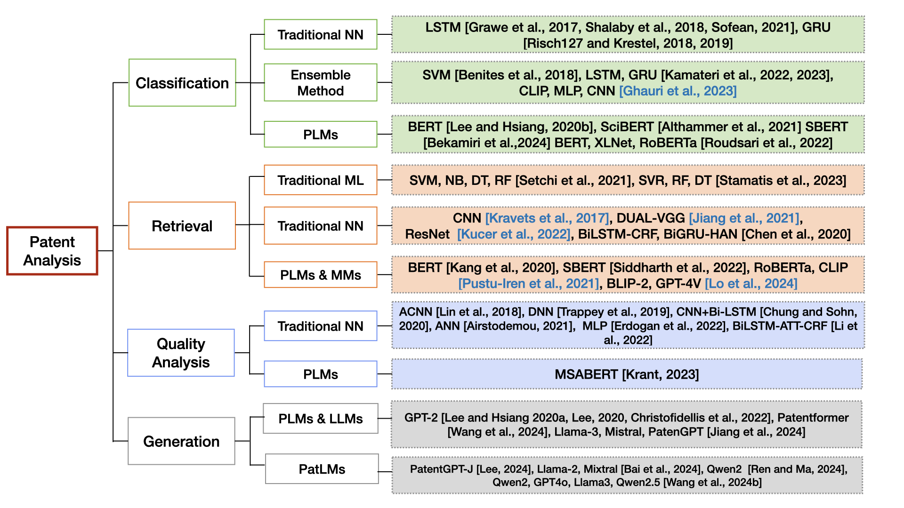

# A Survey on Patent Analysis: From NLP to Multimodal AI
This interdisciplinary survey
aims to serve as a comprehensive resource for
researchers and practitioners who work at the
intersection of NLP, Multimodal AI, and patent
analysis, as well as patent offices to build effi-
cient patent systems.

# Patent Datasets

- USPTO-2M - [Deeppatent: patent classification with convolutional
neural networks and word embedding](https://dl.acm.org/doi/10.1007/s11192-018-2905-5)
- BIGPATENT - [BIGPATENT: A Large-Scale Dataset for Abstractive and Coherent Summarization
](https://aclanthology.org/P19-1212/)
- USPTO-3M - [Patent Classification by Fine-Tuning BERT Language Model](https://www.sciencedirect.com/science/article/abs/pii/S0172219019300742)
- PatentMatch - [Patentmatch: A dataset for matching
patent claims & prior art](https://arxiv.org/abs/2012.13919) 
- DeepPatent - [DeepPatent: Large scale patent drawing recognition and retrieval](https://openaccess.thecvf.com/content/WACV2022/papers/Kucer_DeepPatent_Large_Scale_Patent_Drawing_Recognition_and_Retrieval_WACV_2022_paper.pdf)

- DeepPatent2 - [DeepPatent2: A Large-Scale Benchmarking Corpus for Technical Drawing Understanding
](https://www.nature.com/articles/s41597-023-02653-7)
- HUPD - [The Harvard USPTO Patent Dataset: A Large-Scale, Well-Structured, and Multi-Purpose Corpus of Patent Applications](https://proceedings.neurips.cc/paper_files/paper/2023/hash/b4b02a09f2e6ad29fdbeb1386d68f4c4-Abstract-Datasets_and_Benchmarks.html)
- IMPACT - [MPACT: A Large-scale Integrated Multimodal Patent Analysis and Creation Dataset for Design Patents](https://proceedings.neurips.cc/paper_files/paper/2024/hash/e3301977b92f28e32639ec99eb08f4a1-Abstract-Datasets_and_Benchmarks_Track.html)

# Patent Classification

- [Automated Patent Classification Using Word Embedding](https://ieeexplore.ieee.org/document/8260665)

# Patent Retrieval 

# Patent Quality Analysis

# Patent Generation

